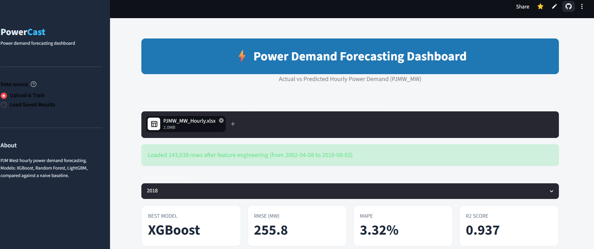
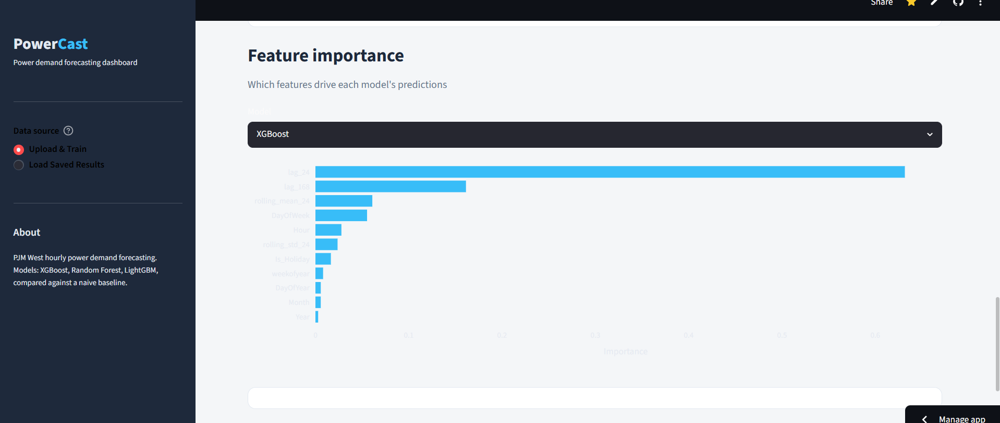
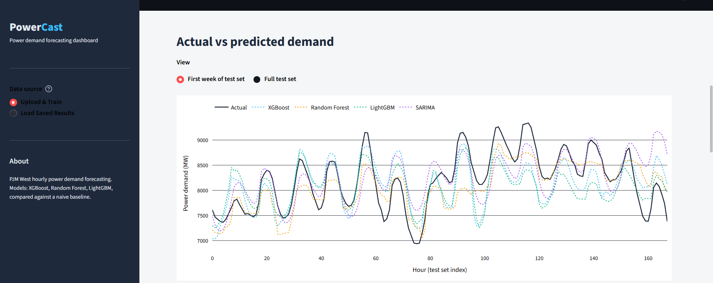
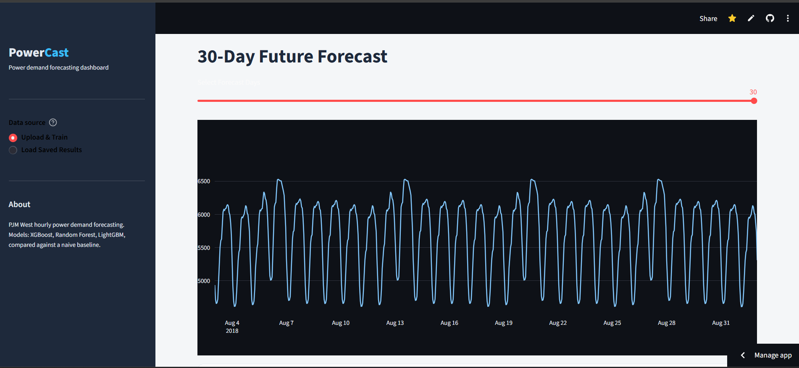

# ⚡ Power Demand Forecasting Using Machine Learning and Time Series Models

## 📌 Project Overview

Power demand forecasting is essential for efficient energy management and smart grid operations. This project predicts hourly electricity demand using historical power consumption data by applying machine learning and time-series forecasting techniques.

The project includes data preprocessing, exploratory data analysis (EDA), feature engineering, model development, model comparison, and deployment of an interactive Streamlit dashboard for real-time forecasting and visualization.

---

## 🎯 Project Objectives

- Forecast hourly electricity demand accurately.
- Perform data preprocessing and feature engineering.
- Analyze historical demand trends through Exploratory Data Analysis (EDA).
- Build and compare multiple forecasting models.
- Deploy an interactive forecasting dashboard using Streamlit.
- Predict future electricity demand for the next 30 days.

---

## 📂 Dataset Information

| Attribute | Details |
|-----------|---------|
| Dataset Name | PJMW Hourly Power Consumption Dataset |
| Dataset Type | Time Series |
| Target Variable | PJMW_MW |
| Frequency | Hourly |
| Format | Excel (.xlsx) / CSV |

---

## 🔄 Project Workflow

```text
Dataset Collection
        │
        ▼
Data Preprocessing
        │
        ▼
Exploratory Data Analysis (EDA)
        │
        ▼
Feature Engineering
        │
        ▼
Train-Test Split
        │
        ▼
Model Training
        │
        ▼
Model Evaluation
        │
        ▼
Model Comparison
        │
        ▼
Best Model Selection
        │
        ▼
Streamlit Dashboard
        │
        ▼
Future Power Demand Forecast
```

---

## 🛠 Technologies Used

- Python
- Pandas
- NumPy
- Matplotlib
- Plotly
- Scikit-learn
- XGBoost
- LightGBM
- Statsmodels
- Streamlit

---

## 🤖 Machine Learning & Time-Series Models

- Linear Regression
- Random Forest Regressor
- XGBoost Regressor
- LightGBM Regressor
- SARIMA

---

## 📊 Evaluation Metrics

The models were evaluated using the following metrics:

- Mean Absolute Error (MAE)
- Root Mean Squared Error (RMSE)
- Mean Absolute Percentage Error (MAPE)
- R² Score

---

## 📁 Project Structure

```text
Power_Demand_Forecasting/
│
├── dataset/
│   ├── Original_Dataset.csv
│   ├── Cleaned_Dataset.csv
│   ├── Train_Dataset.csv
│   ├── Test_Dataset.csv
|   ├── Actual_vs_Predicted_All_Models.csv
│   ├── Evaluation_Metrics.csv
│   └── Forecast_Results.csv
│
├── dataset/
│   ├── Forecasting.png
│   ├── Models_Comparison.png
│   ├── Dashbaord.png
│   ├── Feature_importance.png
│   └── prediction.png
|
├── best_model1.pkl
│
├── Forecasting_Power_Supply_Demand.ipynb
│
├── Forecasting_app.py
│
├── README.md
├── requirements.txt
└── Project_Report.pdf
```

---

## 🚀 Installation

### Clone the Repository

```bash
git clone https://github.com/your-username/power-demand-forecasting.git
```

### Move into the Project Folder

```bash
cd power-demand-forecasting
```

### Install Required Libraries

```bash
pip install -r requirements.txt
```

### Run the Streamlit Application

```bash
streamlit run Forecasting_app.py
```

---

## 💻 Features

- Data preprocessing and cleaning
- Exploratory Data Analysis (EDA)
- Feature Engineering
- Multiple forecasting models
- Model comparison
- Actual vs Predicted visualization
- Feature importance analysis
- Interactive Streamlit dashboard
- 30-day future demand forecasting
- Download prediction results

---

## 📈 Results

The developed forecasting system successfully predicts hourly electricity demand by combining feature engineering, machine learning, and time-series forecasting techniques. Model performance was compared using MAE, RMSE, MAPE, and R² Score to identify the best-performing forecasting model.

---

## 📷 Project Screenshots

### Dashboard



### Model Comparison


### Feature Importance



### Prediction



### 30 Days Forecasting



---

## 🔮 Future Enhancements

- Weather data integration
- LSTM and GRU deep learning models
- Real-time electricity demand forecasting
- Cloud deployment
- Smart grid integration
- Multi-region forecasting

---

## 👥 Team Members

- Aarti Vaibhav Mali
- Arya Ramesh Autade
- Rani Bhanudas Mali
- Vivek P
- Molli Sai Durga Lokesh
- Vedant Thokal

---

## 📄 License

This project was developed for educational and internship purposes as part of the Data Science Program conducted by **Excler** 
---

##  Acknowledgement

We sincerely thanks **Excler**,  our mentors, and all team members for their continuous guidance and support throughout the successful completion of this project.
